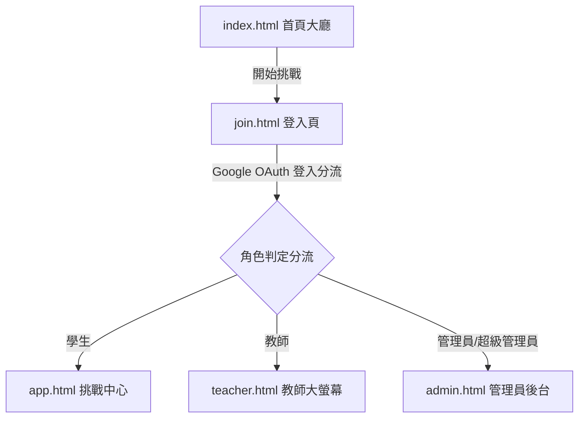

# 新港國小英語單字王 — 網站架構與開發技術文件

本文件記錄「三校聯網・英語單字王挑戰平台」（鳳岡國小、豐田國小、新港國小）的系統架構、資料庫設計、安全機制，以及最新的開發現況與修復日誌。

---

## 🎨 視覺與設計系統 (Design System)

本站採用專為國小學生設計的**清新馬卡龍可愛風格**，提供直覺且具遊戲感的互動介面：
*   **全站漸層背景**：`linear-gradient(135deg, #f5fafd 0%, #f0fdf4 50%, #fefcf0 100%)` (粉藍 ➔ 薄荷綠 ➔ 奶油黃)，搭配 Canvas 慢速動態升起的半透明 glossy 氣泡。
*   **圓潤邊框與 3D 陰影**：卡片與按鈕具有 `24px` 或藥丸形圓角，搭配 `2.5px solid #cbd5e1` 卡通感灰色邊框與向右下偏移的實色投影，按鈕在點選時具有立體按壓效果 (`translateY(2px)`)。
*   **字母磁鐵 (Spelling Tiles)**：拼字遊戲中的字母設計為立體冰箱貼磁鐵質感，懸停時會輕微旋轉與放大，點擊或拖放時具 Q 彈動畫。

---

## 🏗️ 網站系統架構 (Frontend Structure)

前端採用純 HTML5、CSS3 與原生 JavaScript 實作，確保高載入速度與流暢的動態反饋。



### 1. 頁面模組說明

*   **首頁大廳 (`index.html`)**：
    *   展示三校（鳳岡、豐田、新港）累計積分大卡片。
    *   展示滾動動態跑馬燈與全站個人排行榜。
    *   自動偵測登入狀態並變更按鈕為「繼續今日挑戰」。
*   **使用者登入 (`join.html`)**：
    *   包含三校下拉選單（預設新港國小，或選鳳岡、豐田）。
    *   Google 教育帳號整合（限定 `@gapp.hcc.edu.tw`）。
    *   登入成功後，依據 `user_roles` 及超級管理員規則自動分流跳轉。
*   **挑戰中心 (`app.html`)**：
    *   學生挑戰主程式，包含「單字拼寫」、「口說發音」、「單字與句型綜合練習」。
    *   內嵌語音辨識診斷引擎（`js/speech.js`）及挑戰流控制器（`js/challenge.js`）。
    *   包含隨答即檢、答對泡泡擴散、答錯果凍搖晃及間隔複習錯題管理。
*   **教師大螢幕 (`teacher.html`)**：
    *   教師可在課堂展示大螢幕，並一鍵建立 6 位數場次碼（如 `123 456`）。
    *   即時訂閱（Supabase Realtime）學生的課堂答題動態，滾動展示挑戰名冊與即時排行榜。
*   **管理端後台 (`admin.html`)**：
    *   提供超級管理員配置 AI 參數（Gemini 3.5 Flash 主要/備用金鑰、Groq 金鑰）。
    *   管理學生名冊（支援手動新增及批量匯入 CSV，預設新港國小，檢驗網域格式）。
    *   管理教職員角色授權（新增/刪除管理者與教師）。

---

## 🗄️ 資料庫與後端架構 (Supabase Database & Edge Functions)

後端基於 Supabase (PostgreSQL) 構建，透過 RLS 安全政策及 Deno Edge Functions 實現業務邏輯。

### 1. 資料表 Schema 設計

#### 學生名冊表 (`student_roster`)
儲存准許登入的學生白名單：
```sql
CREATE TABLE student_roster (
  email VARCHAR PRIMARY KEY CHECK (email LIKE '%@gapp.hcc.edu.tw'),
  name VARCHAR NOT NULL,
  school VARCHAR NOT NULL, -- '新港國小' | '鳳岡國小' | '豐田國小'
  class VARCHAR NOT NULL,
  grade INT NOT NULL CHECK (grade BETWEEN 3 AND 6),
  enabled BOOLEAN DEFAULT true NOT NULL
);
```

#### 學生個人檔案表 (`students`)
學生首次登入後自動建立：
```sql
CREATE TABLE students (
  uid VARCHAR PRIMARY KEY, -- 對應 auth.users.id
  email VARCHAR UNIQUE NOT NULL,
  name VARCHAR NOT NULL,
  school VARCHAR NOT NULL,
  class VARCHAR NOT NULL,
  grade INT NOT NULL,
  created_at TIMESTAMP WITH TIME ZONE DEFAULT timezone('utc'::text, now()) NOT NULL
);
```

#### 教職員角色授權表 (`user_roles`)
儲存教師及管理員的授權名單：
```sql
CREATE TABLE user_roles (
  email VARCHAR PRIMARY KEY CHECK (email LIKE '%@gapp.hcc.edu.tw'),
  role VARCHAR NOT NULL CHECK (role IN ('admin', 'teacher'))
);
```

#### 課堂挑戰場次表 (`challenge_sessions`)
```sql
CREATE TABLE challenge_sessions (
  id UUID PRIMARY KEY DEFAULT gen_random_uuid(),
  code VARCHAR(6) UNIQUE NOT NULL, -- 6 位數課堂場次碼
  status VARCHAR DEFAULT 'active'::text NOT NULL, -- 'active' | 'closed'
  created_by VARCHAR NOT NULL, -- 教師 Email
  created_at TIMESTAMP WITH TIME ZONE DEFAULT timezone('utc'::text, now()) NOT NULL
);
```

#### 每日挑戰紀錄表 (`daily_attempts`)
```sql
CREATE TABLE daily_attempts (
  id UUID PRIMARY KEY DEFAULT gen_random_uuid(),
  student_uid VARCHAR NOT NULL REFERENCES students(uid),
  score INT NOT NULL,
  streak INT DEFAULT 0 NOT NULL,
  correct_count INT NOT NULL,
  wrong_words JSONB DEFAULT '[]'::jsonb NOT NULL, -- Spaced Repetition 錯字複習清單
  practice BOOLEAN DEFAULT false NOT NULL, -- 是否為練習/課堂模式
  session_code VARCHAR(6), -- 關聯 of 課堂場次碼
  created_at TIMESTAMP WITH TIME ZONE DEFAULT timezone('utc'::text, now()) NOT NULL
);
```

---

## 🔒 安全性與 Row Level Security (RLS) 政策

本站所有資料表皆啟用 Row Level Security (RLS) 防禦，保證學生資料、AI 金鑰及角色授權的安全：

1.  **用戶角色表 (`user_roles`)**：
    *   **SELECT**：任何人登入皆可查詢角色。
    *   **ALL (INSERT/UPDATE/DELETE)**：僅限系統管理者 `hs5743@gapp.hcc.edu.tw` 操作。
2.  **學生名冊表 (`student_roster`)**：
    *   **SELECT**：已登入的校園帳號僅可查詢自己 email 對應的名冊資料（登入驗證用）。
    *   **ALL**：僅限 `service_role` (Edge Function / 管理員) 讀寫。
3.  **學生個人檔案表 (`students`)**：
    *   **SELECT/UPDATE**：學生僅能查詢或更新自己的檔案 (`auth.uid() = uid`)。
    *   **INSERT**：任何登入的 `@gapp.hcc.edu.tw` 校園帳號皆可建立自己的個人檔案。
4.  **挑戰紀錄表 (`daily_attempts`)**：
    *   **SELECT**：學生可查詢自己的紀錄，系統管理員與持有 role 的教職員可讀取全部紀錄（以計算排行榜）。
    *   **INSERT**：學生僅能寫入自己的挑戰紀錄。
5.  **系統設定表 (`system_config`)**：
    *   **ALL**：前端無任何讀取權限，僅 `service_role`（Edge Function）可讀寫，保證 Gemini API 金鑰安全。

---

## 🛠️ 開發現況與修正日誌

### 1. 需求實現清單 (Status Tracker)

| 需求項目 | 實作狀態 | 說明 |
| :--- | :---: | :--- |
| **開發者標示** | ✅ 已加入 | 全站 footer 標示「設計開發：新竹縣新港國小教學團隊」且透明度調為 35%。 |
| **預設學校與三校下拉選單** | ✅ 已加入 | 手動新增學生預設「新港國小」，下拉選單支援「新港國小、鳳岡國小、豐田國小」。 |
| **帳號層級管理** | ✅ 已加入 | 區分系統管理者 (`hs5743@gapp.hcc.edu.tw`)、管理者、教師、學生。系統管理者可授權管理者，管理者可管理教師與學生。 |
| **自動循序漸進挑戰** | ✅ 已加入 | 學生登入直接開始，無需教師手動設關卡。系統根據學習紀錄與錯題集自動生成新題目。 |
| **三大挑戰模式** | ✅ 已加入 | 單字拼寫 (磁鐵拼字/輸入)、口說發音 (語音辨識配對)、句型練習 (結合教育部基礎句型與單字生成)。 |
| **AI 生活情境句** | ✅ 已加入 | 後端 Edge Function 自動適配生活、校園、家庭、節慶等情境，難易度適中。 |
| **錯題間隔複習 (SRS)** | ✅ 已加入 | 每日挑戰中答錯的題目會寫入 `wrong_words` JSONB，並在下次挑戰時優先出現進行複習，階至熟練。 |
| **多維度排行榜** | ✅ 已加入 | 排行榜 View 可依總排行、校排行、年級排行切換展示。 |

### 2. 重大 Bug 修復紀錄 (2026-06-27)

#### 💥 修正「系統載入失敗」與「管理員無法開啟」故障
*   **問題診斷**：
    1.  **全域變數宣告衝突**：官方 Supabase CDN SDK 載入後，會於全域宣告 `var supabase`。然而，我們內部的 `config.js` 採用了 `let supabase = null` 在全域宣告，導致瀏覽器編譯時發生致命命名衝突：`SyntaxError: Identifier 'supabase' has already been declared`。這導致整個腳本編譯中斷，`window.SupabaseConfig` 變為 undefined，引起「系統載入失敗」警示與空白頁面。
    2.  **載入順序與 readyState 競爭**：Supabase 與 config 腳本帶有 `defer` 屬性且原先放在 `<body>` 底部，使得 inline 腳本呼叫時發生時序衝突。
*   **解決方案**：
    1.  **變數改名隔離**：將 `config.js` 內部的 client 變數改名為 `localSupabase`；將 `admin.html` 與 `teacher.html` 內部的 client 變數改名為 `supabaseClient`，完全避開了 SDK 的全域命名衝突。
    2.  **腳本位置優化**：將腳本移至 `<head>` 區塊，並加上強健的 `document.readyState` 載入判定。
    3.  **全面停用伺服器快取**：重新啟動 http-server 為 `http-server -p 3000 -c-1`，徹底避免瀏覽器快取舊代碼。

#### 💥 修正教職員與管理員登入被卡住的問題
*   **問題診斷**：原先 `join.html` 的 callback 預設所有登入帳戶皆為學生，會去查詢 `student_roster` (學生名冊)。當教職員或管理員嘗試登入時，因為不在名冊內而跳出「找不到帳號/驗證失敗」，且會陷入 `app.html` 重定向回 `join.html` 的無限循環。
*   **解決方案**：
    *   在 `join.html` 登入 callback 中加入角色判定：若 email 為 `hs5743@gapp.hcc.edu.tw` 則設為 `super_admin`，若存在於 `user_roles` 則讀取其對應的角色（`admin` / `teacher`）。
    *   根據角色分流跳轉：`super_admin`/`admin` 跳轉至 [admin.html](file:///c:/Antigravity%202026/%E6%96%B0%E6%B8%AF%E5%9C%8B%E5%B0%8F%E8%8B%B1%E8%AA%9E%E5%96%AE%E5%AD%97%E7%8E%8B%E7%B6%B2%E7%AB%99/admin.html)、`teacher` 跳轉至 [teacher.html](file:///c:/Antigravity%202026/%E6%96%B0%E6%B8%AF%E5%9C%8B%E5%B0%8F%E8%8B%B1%E8%AA%9E%E5%96%AE%E5%AD%97%E7%8E%8B%E7%B6%B2%E7%AB%99/teacher.html)、學生在通過名冊核對後跳轉至 [app.html](file:///c:/Antigravity%202026/%E6%96%B0%E6%B8%AF%E5%9C%8B%E5%B0%8F%E8%8B%B1%E8%AA%9E%E5%96%AE%E5%AD%97%E7%8E%8B%E7%B6%B2%E7%AB%99/app.html)。
